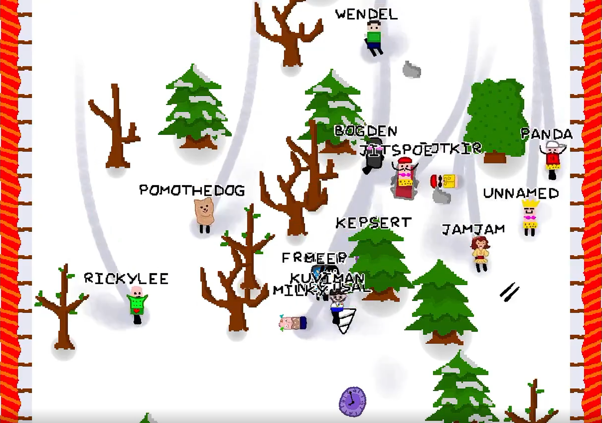

# Extremely Extreme Sports

MMO downhill racing game

[watch the trailer](https://www.youtube.com/watch?v=aNpc3MlN1NY)

A game originally made for [LudumDare 50](https://ldjam.com/events/ludum-dare/50/extremely-exteme-sports).

This now contains post-jam updates. The jam version code can be seen at the `jam-version` [tag](https://github.com/kuviman/extremely-extreme-sports/tree/jam-version).

[CHANGELOG](CHANGELOG.md)


## Play

You can play the game either on [itch.io](https://kuviman.itch.io/extremely-extreme-sports) or on [GitHub Pages](https://kuviman.github.io/extremely-extreme-sports/).

Make sure to bring your friends!



## Join the community

[Discord](https://discord.gg/DZaEMPpANY)

## Building and running locally

First, you'll need to [Install Rust](https://rustup.rs).

Then, just `cargo run --release` will compile and run native client with a local server.

You can pass additional arguments to control more,
like `cargo run --release -- --server 0.0.0.0:1155` will only run a server binding port 1155,
or `cargo run --release -- --connect ws://localhost:1155` will only run a client connecting to that port.

If you want to build a web version, you'll need to:

```shell
# Tell how to connect to the server via an env var
export CONNECT=ws://localhost:1155
# Install wasm32-unknown-unknown target support
rustup target add wasm32-unknown-unknown
# Install wasm-bindgen
cargo install wasm-bindgen-cli                          
# Install engine helper
cargo install cargo-geng --git https://github.com/kuviman/geng
# Compile, run local http server and open the browser once ready
cargo geng run --target wasm32-unknown-unknown --release
# You can also replace run with build, and then serve the target/geng directory yourself
```
