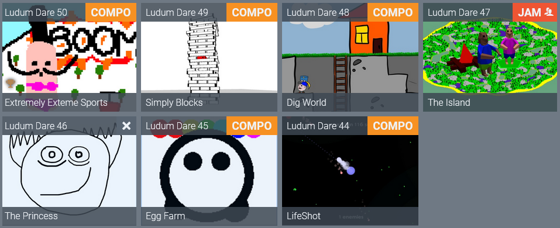
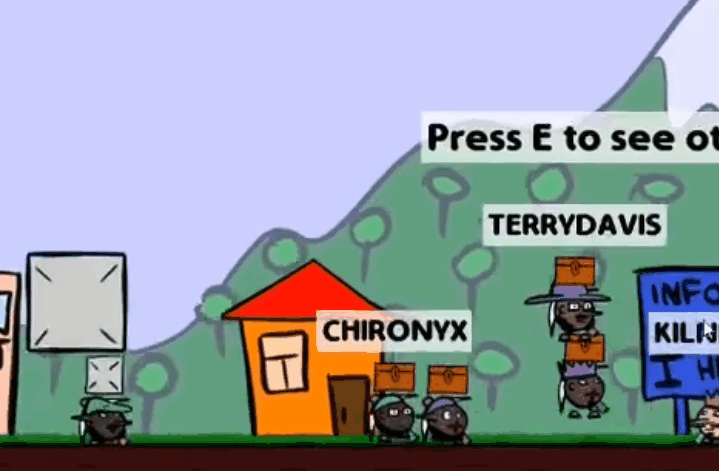

# Extremely Extreme Sports - Post mortem

So, I have made a [game for LD 50](https://ldjam.com/events/ludum-dare/50/extremely-exteme-sports), and **scored top 3 in fun**. Here's how it all went.

[Watch the trailer](https://www.youtube.com/watch?v=aNpc3MlN1NY).

## Part 0. Introduction

[Ludum Dare](https://ldjam.com) is a game jam where you need to create a game in a couple of days. The two main categories are Jam - where you can work with a team and use premade assets with 72 hours limit, or Compo - where you have to do it all by yourself from scratch in just 48 hours.

This is my 6th time I participate in this jam, and, as usual, did the Compo.

Before the jam even begun I had a very rough idea of what I want to make:

1) It has to be an EXTREMELY simple game. One other jam that I enjoyed a lot participating in is the [TriJam](https://trijam.itch.io/) - you have to create a game in **only 3 hours**!

   This let's you practice not overscoping, which is what happens a lot during game jams.

   I really liked the [Circle Race](https://kuviman.itch.io/circle-race) - game I made for one of them, such simple racing mechanics is easy enough to implement and great fun to play.

   

   So let's do something similar? Simple mechanics that I can do in just 3 hours, **no overscoping**, spend the rest of the time just polishing the game.

   I think this is a good strategy also since most people will only play your jam game for 2-5 minutes.

2) I want to have **online multiplayer**. I want to **have character customization**.

   Yep. If you think this is overscoping, maybe you are right. But, this is not the first time I am trying to make a multiplayer for a jam. I have made about 4 of them already, with the [LD 48 - Dig World](https://kuviman.itch.io/dig-world/devlog/255566/so-i-made-an-mmo-in-48-hours) being the most successful one.

   

   Though I believe the problem was that while it was fun on streams with people, playing it alone is kinda boring, the most fun part was just seeing other people.

   I still want that fun experience, but I also want fun gameplay this time.

3) Don't do anything I don't know how to do. While it is fun exploring new technologies and ideas, you can easily just spend the whole time limit just trying to understand how to do what you want.

   This is not to say you shouldn't experiment, you definitely should, and I will definitely do some experimenting other time, but for this jam I just wanted to try make something that works.

So, make a simple but fun mechanics, and multiplayer.

### Custom engine

As always, I'm going to use [my own custom engine](https://github.com/kuviman/geng/) written in [Rust](https://www.rust-lang.org/), since it is what I'm most familiar with. Rust is one of the harder languages to learn, but once you get it, it is actually the easiest (as in easy to get the job done, productive) one. And I believe, and I hope I am proving it here, that it actually is not a bad one for fast prototyping either.

If you are interested in Rust though, I would probably recommend looking at [Bevy](https://bevyengine.org/) or [Macroquad](https://macroquad.rs/). I also know some people are using Rust with [Godot engine](https://godotengine.org/).
I never really tried any of those, but they should still be better supported and documented than my thing ¯\\_(ツ)_/¯.
I have seen about 5 games made in Rust this jam too, and this is what the were using.

## Part 1. Development

So, the theme was announced. **"Delay the inevitable"**.

First idea that came to my mind was to make an office simulator, procrastinating during work doing all kinds of minigames. But, since to do this I would have to implement a lot of small minigames, I discarded the idea almost instantly. I think it is better to do one thing well than a lot of things bad.

Then I remembered another game I made - [Tsunami Run for Siberian Game Jam](https://kuviman.itch.io/tsunami-run). In this game you need to run away from a tsunami, avoiding the obstacles for as long as possible, literally delaying the inevitable crashing into something. I think that game would make perfect hit for the theme, so this is how the Extremely Extreme Sports idea came to my mind.

Instead of tsunami we have an avalanche, and we go skiing, avoiding obstacle for as long as we can. The avalanche gets faster as the time goes, so your demise is inevitable.

### Step 1. Gameplay

So, the first thing to do is to make simple but fun gameplay. So, all there is is just pressing left or right to turn. To make it slightly more fun and closer to actual skiing, your turning speed is limited, and the turn does not affect your direction immediately. Instead, there is friction with the snow in the perpendicular direction of where your skis are facing, so you drift a bit before actually going the way you chose.

Turning angle is limited to 45 degrees so you never stop completely, and the friction makes you slow down if you do turn. So if you want to be fast, you need to not turn as much as possible, which will improve your score by delaying the moment avalanche gets you, but also makes it harder to avoid obstacles.

Spawning the obstacles is just done really quick by randomly spawning them on the track, making sure no two obstacles intersect each other. Obstacles' colliders, as well as players' are just circles so making this simple physics from scratch is very easy. When colliding with an obstacles, all I need to do is zero the speed along the normal of the collision.

### Step 2. Multiplayer

As soon as I was happy enough with the gameplay, I started implementing the multiplayer part.

Since I use my own custom engine, I have moved some stuff for creating simple multiplayer games into it. The way it works is I have a struct that is being synchronized between the server and the client, and that struct is modified on the server when clients send messages. Then the server can also update it when it does the tick, although all that is happening on the server this time is the avalanche.

So, your own character movement is completely calculated on your side, then messages are being sent to the server with your updated position, and thats basically it. The engine will send all the updates to all other clients.

The only thing that I still have to do is the interpolation, since you will be receiving updates less often than your display refresh rate. This is done by maintaining two copies of all the players on the client - the "rendered" one and the "current" one. The current is what was last sent by the server, but also updated just as your own player until the next update arrives. And the rendered one is interpolating towards the current one so that it will become same in 300ms, which is supposed to be a high enough ping so it looks ok. This means that you actually see other people slightly behind their actual position, but, since you can not crash into other players, this should be unnoticeable.

Thanks to all people who came to [my stream](https://www.twitch.tv/kuviman) during the development to help me test the gameplay and multiplayer parts as early as possible.

### Step 3. Graphics

I am **not** good at graphics. Anyway, I liked the hand-drawn style I did previously.

But, this still took me a long time to draw, switching between PC and the drawing tablet all the time also was pretty annoying. So instead this time I tried to do something similar but on PC.

Also, what I have learnt from the Circle Race is that I think if you do pixels you can get good looks with less details.

So, lets do all the graphics in Paint, right? Well, I actually used [Paint.NET](https://www.getpaint.net/) since it also supports transparency and layers.

Another good options would probably be [Aseprite](https://www.aseprite.org/), or it's open source fork [LibreSprite](https://libresprite.github.io), but I never tried them.

I struggled a lot with the trees, but I think they turned out ok, but for the other things I decided to spend less time since I still had other work to do, so most of the textures were made in less than 1 minute.

Also decided to draw a custom font this time, and I think the overall looks of the game is consistent and silly and charming enough, so I actually liked almost everything. There are some bad parts, like coats covering half of your face, but the style itself is something I will try to get better at and use more.

### Step 4. Audio

I know only two ways of creating sound effects: [bfxr](https://www.bfxr.net/), and recording something with microphone.

For this game I thought the second option is better so I did most of the sound effects with just my mouth. Also one of the crash sound effects was made by breaking pasta near the microphone.

Music is also my weakness, but I know at least one way to do it - grab a guitar and just play 4 random chords. Easy, fast, but I should try improving my skills here too.

### Step 5. Character customization

I really liked how the character customization options in my LD 48 game - Dig World, even though the menu itself could be better.

This time though I made something simpler since I was a bit tired at that point, but I think it is still a really cool and essential feature for the game that has multiplayer.

You can choose 4 face options, 4 hats, 4 coats, 4 pants, and choose either skis or a snowboard.

### Step 6. Emotes

Last thing that I had in mind, and I was unsure if I would get to it, was emotes. Just seeing each other in the game is cool and all, but some sort of communication would be nice to have.

I decided not to have an in-game chat, since it need more space on the screen and also hard to type while riding, so I think emotes was a great addition. Turned out to be really easy to implement too, will definitely do it again next time.

So, you can show some love with the heart emote, bm people with the LUL emote, and show thumbs up or thumbs down.

### Step 7. Sleep

Sleep is important. Although, now that I know the results I feel a little bad for not sleeping less. Out of 48 hours given, only 19 were spent on actual development.

The code in the end was EXTREMELY bad spaghetti but hey, the job was done, we now have a working game.

## Part 2. Play & rate phase

After the development finishes, the play & rate phase starts and lasts for 3 weeks. This is actually the most fun part of the jam. You play all the other amazing games people made, and of course see people playing your game. Especially seeing your game played on stream, getting feedback and live reaction is great to understand what you did right, and what you could improve.

A lot of people compared my game to SkiFree, an old game built into Windows XP? Well, as I have written earlier, I did not even remember this one when coming up with the idea. _No Yeti here_.

I have [streamed playing games myself](https://www.twitch.tv/kuviman), and have seen a lot of cool ones. Of the total **96 games I played**, here's my top tier list:

1) [Aloft](https://ldjam.com/events/ludum-dare/50/aloft) - EXTREMELY HARD
2) [Re: Placement](https://ldjam.com/events/ludum-dare/50/re-placement) - EXTREMELY CHILL
3) [The Lars Mission](https://ldjam.com/events/ludum-dare/50/the-lars-mission) - EXTREMELY WELL DONE
4) [Recycle This!](https://ldjam.com/events/ludum-dare/50/recycle-this) - EXTREMELY GREAT
5) [Kinderkaos](https://ldjam.com/events/ludum-dare/50/kinderkaos) - EXTREMELY FUNNY
6) [Healer's Handbook](https://ldjam.com/events/ludum-dare/50/healers-handbook) - EXTREMELY COOL
7) [Paddle Panic](https://ldjam.com/events/ludum-dare/50/paddle-panic) - EXTREMELY DANGEROUS

## Part 3. The tournament

During one of my streams, [PomoTheDog](https://www.twitch.tv/pomothedog) and a bunch of other nerds were playing my game. And they were getting higher and higher scores, with the top score exceeding 100k. This was really interesting since during development I thought that 70k would be unreachable so I only spawned obstacles until 100k. Well, I guess I did my math wrong, that was really impressive to witness, I have only managed to reach 95k at some point.

Anyway, this was a start for something really cool - Pomo decided to organize the first Ludum Dare Score Chasers Tournament. During the tournament a bunch of players were playing six games from the jam, including mine, trying to go for the highest scores.

For the sake of the event I have made custom character skins for all the participants (and some more) referencing their avatar/game characters:

- [itsboats](https://www.twitch.tv/itsboats)' lizard
- [badcop](https://www.twitch.tv/badcop_)
- [Penguin](https://ldjam.com/events/ludum-dare/50/adelie-chasing-pavements)
- [kuviman](https://www.twitch.tv/kuviman)
- [PomoTheDog](https://www.twitch.tv/pomothedog)
- [Giraffe on Clock](https://ldjam.com/events/ludum-dare/50/giraffe-oclock)
- Nertsal was riding [6 feet under drill](https://ldjam.com/events/ludum-dare/48/6-feet-under) - a game from LD 48, still waiting for the full release btw
- [Black amogus](https://ldjam.com/events/ludum-dare/50/infinite-record-sorters)
- [BasicMilky](https://ldjam.com/events/ludum-dare/50/keep-it-steaming)
- jamjamem
- [wendel-scardua](https://ldjam.com/events/ludum-dare/50/stallar)
- [frozendoze](https://www.twitch.tv/frozendoze)
- [Balloon from Aloft](https://ldjam.com/events/ludum-dare/50/aloft)
- fish - reference to another game programmed in Rust: [Fish Fight](https://spicylobster.itch.io/fishfight)
- [potkirland](https://www.twitch.tv/potkirland)'s yellow shirt no pants
- [jitspoe](https://www.twitch.tv/jitspoe)'s [lawnchair](https://ldjam.com/events/ludum-dare/50/rocket-lawnchair)
- there's a couple more, not featured skins

The event was EXTREMELY fun, thanks to all

[Here's a video of just the Extremely Extreme Sports](https://www.youtube.com/watch?v=d3hf84BP9W4), and [here's a recording of the full tournament](https://www.youtube.com/watch?v=IyEIap3TX0k). I took a part in it myself actually and took 4th place!

## Part 4. Results

Finally, the results day has come. I was pretty sure this time with my game to get into a top 100, but you never know. Previously, my best game was [Egg Farm from LD 45](https://kuviman.itch.io/egg-farm) which was top 50 in fun.

But this time I actually got **3rd place in Fun category and 22nd overall** which is EXTREMELY cool.

Fun is the category that actually matters, right? Right?

Anyway thanks everyone for the high ratings.

## Part 5. Future

I am going to try to continue development of this game, as I think it has a lot of potential.

One thing that has already been done after the jam is mobile support. It is pretty basic but works for now.

If you liked this little game I made, feel free to join [our Discord community](https://discord.gg/DZaEMPpANY), or follow the updates on [GitHub](https://github.com/kuviman/ld50).

Thank you all for reading!
